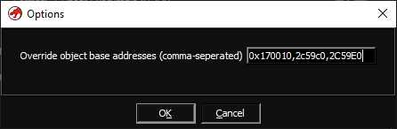
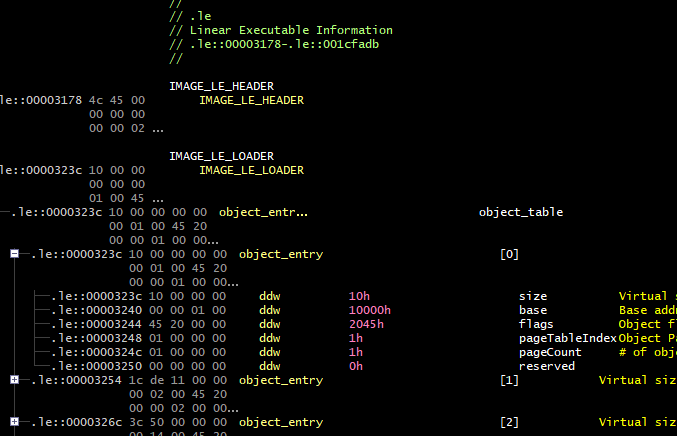
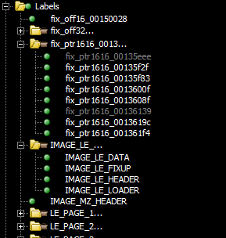
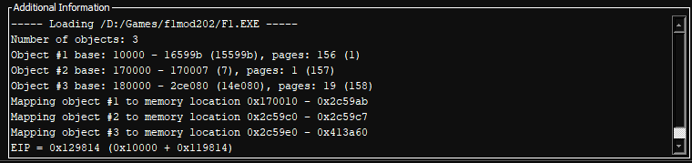

# Ghidra Loader for the LX/LE executable file format

Download a release matching your ghidra version from the [releases](https://github.com/yetmorecode/ghidra-lx-loader/releases) to the `Extensions/Ghidra` inside your Ghidra installation and enabled it from `File > Install extensions...`.

## Features

* Adds support for LX and LE-style executable formats to Ghidra
* Can load bound and unbound (like `sb.exe /u`) executables
* Full page-map and fixup (relocation) support
* MZ and LX image data (headers, loader section, etc.) can be mapped to an overlay 
* Full fixup support for all types

Various options can be specified when loading a file:

* Manually override the object base addresses and segment selectors (good for syncing with a debugger / DOSBox)
* Map image to overlay:
  * Map MZ Header
  * Map LX Header
  * Map LX Loader Section
  * Map LX Fixup Section (fully typed!)
  * Map LX Data Section (i.e. the unmodified page data)
* Create labels for each fixup in memory
* Create labels for each page beginning in memory
* Log fixup statistics / Log individual fixup types
  

## Manually overriding base addresses and segment selectors

The loader can be instructed to manually override the base addresses and selectors of the executable's objects. I use this to feed Ghidra the same memory layout and segment selectors as I find in the dosbox debugger. In return I can use the same addresses found in Ghidra to set breakpoints in the debugger etc.

To override the base addresses, just enter a comma-seperated list of hex values into the field:

The loader will adjust the locations (and fixups!) accordingly:

## Resources

* https://ghidra-sre.org/
* https://moddingwiki.shikadi.net/wiki/Linear_Executable_(LX/LE)_Format
* https://github.com/yetmorecode/dos32a/blob/master/src/dos32a/loader.asm
* https://github.com/open-watcom/open-watcom-v2/blob/master/bld/watcom/h/exeflat.h

## Tested with

* F1 Manager Professional (F1.exe): https://www.mobygames.com/game/dos/f1-manager-professional
* The Elder Scrolls Redguard (RGFX.exe): https://en.wikipedia.org/wiki/The_Elder_Scrolls_Adventures:_Redguard

## Feedback

If you got any feedback, please don't hesitate to open a ticket. Even if you are just using the loader without any issues I'd be happy to hear about :)
